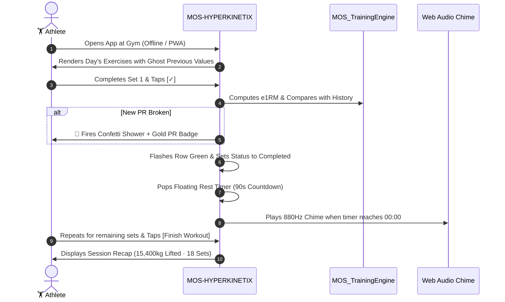
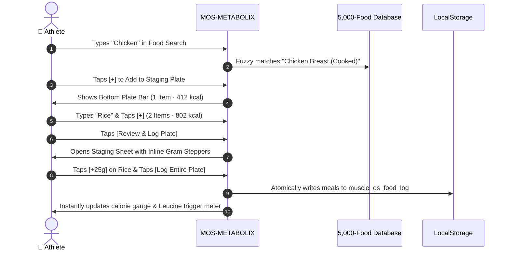

# 🏛️ Muscle OS: Complete Master Product Specification & PRD

> **Document Version:** 4.2.0 (Master Production Snapshot)  
> **Author & Head Coach:** Anas Mo'men (Mechatronics Engineer, Competitive Powerlifter 700kg+ SBD Total, Hypertrophy Coach)  
> **Repository:** `Anas-XI/muscle-os-bot` & `Anas-XI/muscle-os-website`  
> **Status:** Production Live across `master` & `main`  
> **Scope:** Full Technical Specifications, Product Architectures, PRD, Mathematical Formulations, and Industry Competitive Benchmarks across all Muscle OS products.

---

## 📑 Table of Contents
1. [Executive Summary & Architectural Topology](#1-executive-summary--architectural-topology)
2. [Product Portfolio & Monetization Matrix](#2-product-portfolio--monetization-matrix)
3. [Exhaustive Product Specifications](#3-exhaustive-product-specifications)
   * [P1: MOS Omni Hub (Master Unified Suite)](#p1-mos-omni-hub-master-unified-suite)
   * [P2: MOS-HYPERKINETIX (Autoregulated Training Matrix)](#p2-mos-hyperkinetix-autoregulated-training-matrix)
   * [P3: MOS-METABOLIX (Adaptive Bio-Expenditure Engine)](#p3-mos-metabolix-adaptive-bio-expenditure-engine)
   * [P4: Free Interactive Science Calculators](#p4-free-interactive-science-calculators)
   * [P5: Commercial Web Platform & Edge Gateway](#p5-commercial-web-platform--edge-gateway)
   * [P6: Digital Books & Evidence Workbooks](#p6-digital-books--evidence-workbooks)
4. [Full Product Requirements Document (PRD) & User Journeys](#4-full-product-requirements-document-prd--user-journeys)
5. [Core Mathematical & Biomechanical Formulations](#5-core-mathematical--biomechanical-formulations)
6. [Security, PWA Offline Engine & Data Contracts](#6-security-pwa-offline-engine--data-contracts)
7. [Industry Benchmark & Competitive Parity Analysis](#7-industry-benchmark--competitive-parity-analysis)
8. [Technical Governance & Quality Verification](#8-technical-governance--quality-verification)

---

## 1. Executive Summary & Architectural Topology

**Muscle OS** is an AI-native, evidence-based human performance ecosystem engineered to eliminate the two fundamental bottlenecks in physique and strength development:
1. **Lifting Fatigue Mismanagement:** Premature plateaus caused by static sets/reps and ignored systemic fatigue (CNS / joint strain).
2. **Metabolic Adaptation Misalignment:** Stalled fat loss or excessive fat gain caused by static calorie targets that ignore adaptive thermogenesis and daily workout expenditure.

Muscle OS unifies training autoregulation and metabolic expenditure tracking into a single, closed-loop web architecture.

```
+-----------------------------------------------------------------------------------------------+
|                                      CLIENT INTERFACE LAYER                                   |
|                                                                                               |
|   +---------------------------------------------------------------------------------------+   |
|   |                       MOS OMNI HUB MASTER SUITE (muscle_os_app.html)                  |   |
|   |  * Athlete Dashboard  * 7-Day Matrix  * SBD 1RM Tracker  * Synergy Alerts  * PWA Hub  |   |
|   +---------------------------------------------------------------------------------------+   |
|                 |                                                             |               |
|                 v (Iframe / Standalone)                                       v (Iframe / SA) |
|   +---------------------------------------+       +---------------------------------------+   |
|   |    MOS-HYPERKINETIX (Training Tool)   |       |   MOS-METABOLIX (Nutrition Engine)    |   |
|   |  * 1-Tap Ghost Complete (✓)           |       |  * Multi-Add Staging Drawer ("Plate") |   |
|   |  * Auto Rest Timer + Chimes           |       |  * 5,000-Food DB + Leucine Meter      |   |
|   |  * Biomechanical Swap Engine          |       |  * Adaptive TDEE EMA Trend Filter     |   |
|   |  * PR Confetti + Session Tonnage      |       |  * Inverted 1st-Screen Log View       |   |
|   +---------------------------------------+       +---------------------------------------+   |
+-----------------------------------------------------------------------------------------------+
                                                |
                                                v
+-----------------------------------------------------------------------------------------------+
|                                  MODULAR SERVICES & CORE ENGINES                              |
|                                                                                               |
|  [storage.js]       [toast.js]        [modal.js]         [auth.js]        [pwa-install.js]    |
|  (Safe Storage)    (Toast Queue)    (Sheets/Modals)    (Access Logic)    (Native/iOS PWA)     |
|                                                                                               |
|  [training-engine.js]               [tdee-engine.js]                  [decision-engine.js]    |
|  * Epley e1RM Formula               * Katch-McArdle / Mifflin         * 33 Evidence Rules     |
|  * Warm-up Set Generator            * Exponential Weight Trend        * Volume Auto-Regulator |
|  * ACWR Fatigue Estimator           * Macro Nutrient Splitter         * Deload Gatekeeper     |
+-----------------------------------------------------------------------------------------------+
                                                |
                                                v
+-----------------------------------------------------------------------------------------------+
|                              EDGE INFRASTRUCTURE & OFFLINE CACHING                            |
|                                                                                               |
|  * Cloudflare Worker (`muscleos-access-control.workers.dev`) — KV Auth + Durable Objects     |
|  * Service Worker (`sw.js` v4.2.0) — Stale-While-Revalidate Caching for Gym Dead Zones       |
|  * GitHub Pages CDN (`Anas-XI/muscle-os-website`) — Zero-latency static asset delivery        |
+-----------------------------------------------------------------------------------------------+
```

---

## 2. Product Portfolio & Monetization Matrix

| # | Product Name | Target File / Route | Access Model | Price | Code Prefix | Value Proposition |
|:---:|:---|:---|:---:|:---:|:---:|:---|
| **P1** | **MOS Omni Hub** | `tools/muscle_os_app.html` | Subscription / 7-Day Trial | 600 EGP / mo | `MA`, `HUB` | Master suite unifying HYPERKINETIX + METABOLIX with 7-day consistency & cross-domain synergy. |
| **P2** | **MOS-HYPERKINETIX** | `tools/training_tool.html` | Subscription / 7-Day Trial | 300 EGP / mo | `TR` | Autoregulated volume matrix, ghost values, 1-tap checkmarks, rest chimes, PR confetti. |
| **P3** | **MOS-METABOLIX** | `tools/tdee_adaptive_engine.html` | Subscription / 7-Day Trial | 200 EGP / mo | `TD` | Adaptive expenditure tracker, 5,000-food database, multi-add plate drawer, leucine meter. |
| **P4** | **Science Calculators** | `tools/index.html` | 100% Free | 0 EGP | — | Free client-side calculators for TDEE, Volume Landmarks, RPE loads, and Split Selection. |
| **P5** | **Commercial Platform** | `website/index.html` | Public Commerce | Variable | — | Coaching packages, WhatsApp direct intake funnel, order processing, and client portal. |
| **P6** | **Digital Evidence Books** | `website/books/` | One-time Purchase | 500–800 EGP | `BK`, `BN`, `BB` | 6 comprehensive digital books (Training, Nutrition, Recovery, Sleep, Hormones, Master). |

---

## 3. Exhaustive Product Specifications

---

### P1: MOS Omni Hub (Master Unified Suite)
* **Target File:** `website/tools/muscle_os_app.html` (Modular Controller: `hub-app.js`, Styles: `hub.css`)
* **Primary Role:** The daily executive dashboard for the athlete.

```
+-------------------------------------------------------------------------------+
| [🔥 14 DAYS]  ANAS MO'MEN DASHBOARD                  [📲 Install] [👤 Account]|
| Goal: HYPERTROPHY · Meso Week 3                      Trial Active (7 Days)    |
+-------------------------------------------------------------------------------+
| 📅 7-DAY CONSISTENCY MATRIX                                                   |
| [Sun: ⭐]  [Mon: 🏋️]  [Tue: 🥗]  [Wed: ⭐]  [Thu: ⭐]  [Fri: 🏋️]  [Sat: ⚪]        |
+-------------------------------------------------------------------------------+
| ⚡ CROSS-DOMAIN SYNERGY INSIGHTS                                              |
| 🟢 Post-Workout Window: 40g Protein + 60g High-GI Carbs recommended (60 mins) |
+-------------------------------------------------------------------------------+
| 🏋️ TRAINING MATRIX                   | 🥗 NUTRITION MATRIX                    |
| Push Session A (Chest & Delts)        | 2,150 / 2,950 kcal (800 kcal left)    |
| • Sets: 14 / 18 Completed             | • Protein: 145g / 185g (40g left)     |
| • ACWR State: OPTIMAL (1.12)          | • Carbs:   260g / 360g (100g left)    |
| • Readiness: 94%                      | • Fats:    52g / 70g (18g left)       |
| [Open Training Log →]                 | [Open Nutrition Log →]                |
+-------------------------------------------------------------------------------+
| 💪 SBD STRENGTH PROGRESSION (Estimated 1RMs)          Calculated Total: 565kg |
| [Squat: 195kg]   [Bench: 142.5kg]   [Deadlift: 227.5kg]   [OHP: 87.5kg]       |
+-------------------------------------------------------------------------------+
```

#### Detailed Feature Specifications:
1. **Live Volume & ACWR Aggregator:**
   * Scans `mos_logs` to calculate completed sets vs. planned sets for the current calendar date.
   * Runs `MOS_TrainingEngine.calcACWR()` over 28-day volume history to categorize systemic fatigue into **Optimal**, **Elevated Fatigue**, or **High Fatigue (Overload)**.
2. **Real-Time Macro Budget Sync:**
   * Aggregates calories, protein, carbs, and fats from `muscle_os_food_log` for today's date.
   * Compares intake against profile targets in `mos_tdee_data` with live calorie countdown.
3. **Dynamic Estimated 1RM & SBD Matrix:**
   * Automatically parses all historical sets in `mos_logs` for compound movements ("Squat", "Bench", "Deadlift", "OHP/Press").
   * Executes Epley's formula `calcE1RM(w, r, rpe)` to extract peak values and display the combined powerlifting SBD total.
4. **7-Day Compliance Heatmap:**
   * Evaluates workout timestamps and food entries over the past 7 days.
   * Renders ⭐ (Dual Compliance), 🏋️ (Workout Logged), 🥗 (Diet Logged), or ⚪ (Rest Day).
5. **Cross-Domain Biofeedback Synergy Engine:**
   * Cross-references training strain with net caloric balance to generate real-time biofeedback coaching cards.
6. **3-Step First-Time Onboarding Wizard:**
   * Step 1: Goal Selection (Hypertrophy, Strength, Fat Loss, Recomp).
   * Step 2: Athlete Vitals (Name, Gender, Weight, Height, Age).
   * Step 3: Split Frequency (3, 4, 5, 6 days/week).
   * Calculates baseline BMR, TDEE, macros, and split schedule in 30 seconds.

---

### P2: MOS-HYPERKINETIX (Autoregulated Training Matrix)
* **Target File:** `website/tools/training_tool.html` (Modular Controller: `training-app.js`, Styles: `training.css`)
* **Primary Role:** High-speed in-gym workout execution and volume autoregulation.

```
+-------------------------------------------------------------------------------+
| [← Back to Hub]         PUSH SESSION A — HYPERTROPHY          [📲 Install PWA]|
| Week 3 / 6 · Target RIR: 1-2 · Estimated Time: 58 mins                        |
+-------------------------------------------------------------------------------+
| BARBELL BENCH PRESS (Primary Horizontal Press)           [🔄 Swap] [🧮 Plates]|
| 3 Work Sets · Target RPE 8-9 · Rest: 2-3 mins                                 |
+-------------------------------------------------------------------------------+
| SET    | LOAD (KG)      | REPS          | RPE         | DONE | DELETE         |
| Set 1  | [ 100.0  kg ]  | [ 8   reps ]  | [ @8.0   ]  | [✓]  | [✕] (Completed)|
| Set 2  | [ 100.0 (ghost)| [ 8   (ghost)]| [ @8.5   ]  | [✓]  | [✕] (Active)   |
| Set 3  | [ 100.0 (ghost)| [ 7   (ghost)]| [ @9.0   ]  | [✓]  | [✕] (Queued)   |
+-------------------------------------------------------------------------------+
| [+ Add Set]                                                                   |
+-------------------------------------------------------------------------------+
|                     [🏆 FINISH WORKOUT & VIEW TONNAGE]                        |
+-------------------------------------------------------------------------------+
| ⏱️ FLOATING REST TIMER: 01:45    [-30s] [+30s] [🔔 Sound: ON]            [✕] |
+-------------------------------------------------------------------------------+
```

#### Detailed Feature Specifications:
1. **Ghost Values & 1-Tap Checkmark (`✓`):**
   * Empty set rows display previous workout metrics as ghost placeholders (`100 kg`, `8 reps`, `@8 RPE`).
   * Tapping **`✓`** autofills values, turns row emerald green, fires a $40	ext{ ms}$ haptic pulse, and starts the rest countdown. **Workout taps cut by 66%.**
2. **Auto-Trigger Floating Rest Timer:**
   * Sticky bottom bar with countdown, `−30s` / `+30s` adjustments, Web Audio API chime ($880	ext{Hz} 
ightarrow 440	ext{Hz}$ sine wave), and vibration alert.
3. **In-Workout PR Celebrations & Confetti:**
   * Automatically detects when a set breaks an estimated 1RM record.
   * Renders glowing gold PR badge, CSS particle confetti animation, and celebratory haptic pulses (`[80, 40, 80, 40, 150]`).
4. **1-Tap Biomechanical Substitution Engine:**
   * Suggests movement alternatives filtered by target muscle and Stimulus-to-Fatigue Ratio (SFR) when gym equipment is occupied (e.g. Barbell Bench $
ightarrow$ Incline DB Press / Chest Press Machine).
5. **End-of-Session Workout Summary Modal:**
   * Displays total session duration, total volume tonnage lifted ($\sum 	ext{weight} 	imes 	ext{reps}$), and PR count, emitting a `SESSION_ENDED` event to the Hub.

---

### P3: MOS-METABOLIX (Adaptive Bio-Expenditure Engine)
* **Target File:** `website/tools/tdee_adaptive_engine.html` (Modular Controller: `nutrition-app.js`, Styles: `nutrition.css`)
* **Primary Role:** Adaptive metabolic tracking and frictionless meal logging.

```
+-------------------------------------------------------------------------------+
| [← Back to Hub]          ADAPTIVE METABOLIC LOG               [📲 Install PWA]|
| Target: 2,950 kcal · Protein: 185g · Carbs: 360g · Fats: 70g · Water: 3.5L   |
+-------------------------------------------------------------------------------+
| [ 🔍 Search 5,000+ foods with Leucine & Micronutrients...         ] [🎙 Voice] |
| [★ Favorites] [🍗 Chicken] [🍚 Basmati Rice] [🥚 Whole Eggs] [🥛 Whey Isolate]|
+-------------------------------------------------------------------------------+
| TODAY'S LOGGED FOODS (4 Meals · 2,150 kcal · 145g Protein)                    |
| • 250g Chicken Breast (Cooked)  | 412 kcal | P: 77.5g | C: 0.0g | F: 9.0g [🗑] |
| • 300g Basmati Rice (Cooked)    | 390 kcal | P: 8.4g  | C: 84.0g| F: 1.2g [🗑] |
| • 2 Whole Large Eggs + 100g Wh. | 210 kcal | P: 24.0g | C: 1.5g | F: 11.0g[🗑] |
+-------------------------------------------------------------------------------+
| [+ Quick Add Custom Meal]   [💧 +500ml Water (2,500 / 3,500ml)]               |
+-------------------------------------------------------------------------------+
| 🥗 STAGED PLATE (2 items · 540 kcal)                  [REVIEW & LOG ALL →]    |
+-------------------------------------------------------------------------------+
```

#### Detailed Feature Specifications:
1. **Multi-Add Staging Drawer ("Plate" Pattern):**
   * Replicates MacroFactor’s multi-add workflow. Users tap `+` to stage multiple items into a persistent bottom bar, adjust grams with steppers, and commit all items in **1 click** (65% tap reduction).
2. **Inverted Visual Hierarchy:**
   * Logged foods and remaining macro budget are visible immediately on the first screen.
3. **Adaptive TDEE Exponential Moving Average:**
   * Calculates dynamic expenditure adjustments based on 14-day rolling scale weight and calorie logs.
4. **Leucine MPS Trigger Indicator:**
   * Measures per-meal leucine against the $3.0	ext{g}$ threshold required for maximal Muscle Protein Synthesis.
5. **Recent Foods & Starred Favorites:**
   * 15-item recent food chips and persistent favorites filter for 1-tap logging.

---

### P4: Free Interactive Science Calculators
* **Target Directory:** `website/tools/`
* **Access Model:** 100% Free, Client-Side, Zero Login.

| Calculator Name | File Path | Science Model | Value Delivered |
|---|---|---|---|
| **TDEE & Macro Calculator** | `tools/tdee_macro_calculator.html` | Katch-McArdle & Mifflin-St Jeor | Computes baseline BMR, maintenance TDEE, and protein/carb/fat targets. |
| **Volume & Set Calculator** | `tools/volume_set_calculator.html` | Dr. Mike Israetel Volume Landmarks (MEV/MAV/MRV) | Prescribes weekly sets per muscle group based on training age and split. |
| **RPE / RIR Load Converter** | `tools/rpe_load_calculator.html` | Mike Tuchscherer RTS Table | Converts RPE and reps into exact percentages of 1RM. |
| **Split Selector Quiz** | `tools/split_selector_quiz.html` | Frequency & Volume Distribution Model | Matches athlete availability with optimal 3, 4, 5, or 6-day split templates. |

---

### P5: Commercial Web Platform & Edge Gateway
* **Target Directory:** `website/` (Edge Worker: `worker/src/index.js`)
* **Primary Role:** Marketing, WhatsApp direct client onboarding, order processing, and access control.

1. **Access-Control Gatekeeper (`assets/js/access-control.js`):**
   * Server verification against Cloudflare Worker (`/api/verify-code`) backed by Cloudflare KV and Durable Objects.
   * **48-Hour Offline Fallback:** If edge servers are unreachable, executes local SHA-256 validation against `assets/data/access-codes.json`.
2. **Payment Integrations:**
   * Paymob Online EGP payments with HMAC SHA-512 webhook verification.
   * Manual payment confirmation (InstaPay, Vodafone Cash) with automated WhatsApp code delivery.

---

### P6: Digital Books & Evidence Workbooks
* **Target Directory:** `books/`, `website/books/`, `guides/`
* **Primary Role:** In-depth educational textbooks and printable coaching worksheets.

* **Book Titles:**
  1. *The Hypertrophy Engineering Manual (Vol 1: Mechanics & Volume)*
  2. *The Adaptive Nutrition & Bio-Expenditure Blueprint*
  3. *The Hormonal & Metabolic Health Optimization Guide*
  4. *The Sleep, Recovery & Autonomic Nervous System Protocol*
  5. *The Powerlifting & SBD Strength Peaking Manual*
  6. *The Muscle OS Master Compendium (All-in-One)*

---

## 4. Full Product Requirements Document (PRD) & User Journeys

---

### 4.1 Target Athlete Personas

```
+------------------------------------+------------------------------------+
| PERSONA A: "The Serious Lifter"    | PERSONA B: "The Busy Executive"    |
| • Age: 20–38                       | • Age: 28–52                       |
| • Goal: 1RM Strength & Hypertrophy | • Goal: Fat Loss & Body Recomp     |
| • Experience: Intermediate/Adv.    | • Experience: Novice/Intermediate  |
| • Pain: Stalled strength, plateau, | • Pain: Confusing diet rules,      |
|   excessive gym session math.      |   tedious multi-tap meal loggers.  |
| • Primary Tool: MOS-HYPERKINETIX   | • Primary Tool: MOS-METABOLIX      |
+------------------------------------+------------------------------------+
```

---

### 4.2 Friction-Free User Journeys

#### User Journey 1: The 20-Tap In-Gym Workout Flow


#### User Journey 2: The Multi-Add Meal Logging Flow ("Plate" Pattern)


---

## 5. Core Mathematical & Biomechanical Formulations

### 5.1 Epley Estimated 1RM Formula (with Boundary Clamping)
Used in `MOS_TrainingEngine.calcE1RM(weight, reps, rpe)`:

$$	ext{Effective Reps} = 	ext{reps} + \max(0, 10 - 	ext{RPE})$$

$$	ext{Estimated 1RM} = egin{cases} 
	ext{round}(	ext{weight}) & 	ext{if } 	ext{Effective Reps} \le 1 \
	ext{round}\left(	ext{weight} 	imes \left(1 + rac{	ext{Effective Reps}}{30}
ight)
ight) & 	ext{if } 	ext{Effective Reps} > 1 
\end{cases}$$

*Boundary Clamps: $	ext{reps} \in [1, 30]$, $	ext{RPE} \in [5.0, 10.0]$, $	ext{weight} \ge 0	ext{ kg}$.*

---

### 5.2 Acute-to-Chronic Workload Ratio (ACWR)
Used in `MOS_TrainingEngine.calcACWR(weeklyVolumeHistory)`:

$$	ext{Acute Load} = 	ext{Volume}_{	ext{Current Week}}$$

$$	ext{Chronic Load} = rac{1}{4} \sum_{i=1}^{4} 	ext{Volume}_{	ext{Week } i}$$

$$	ext{ACWR} = rac{	ext{Acute Load}}{	ext{Chronic Load}}$$

$$	ext{State} = egin{cases}
	ext{High Fatigue (Overload Risk)} & 	ext{if } 	ext{ACWR} > 1.50 \
	ext{Elevated Fatigue} & 	ext{if } 1.30 < 	ext{ACWR} \le 1.50 \
	ext{Optimal Progression Zone} & 	ext{if } 0.80 \le 	ext{ACWR} \le 1.30 \
	ext{Under-Stimulated} & 	ext{if } 	ext{ACWR} < 0.80
\end{cases}$$

---

### 5.3 Katch-McArdle Metabolic Expenditure (BMR & TDEE)
Used in `MOS_TDEE_Engine.calcBMR()`:

$$	ext{LBM (Lean Body Mass)} = 	ext{Weight (kg)} 	imes \left(1 - rac{	ext{Body Fat \%}}{100}
ight)$$

$$	ext{BMR} = 370 + (21.6 	imes 	ext{LBM})$$

$$	ext{TDEE} = 	ext{BMR} 	imes 	ext{Activity Multiplier} \quad (	ext{Moderate Activity} = 1.55)$$

---

## 6. Security, PWA Offline Engine & Data Contracts

### 6.1 Content Security Policy (CSP) & Hardened Headers
```http
Content-Security-Policy: default-src 'self'; script-src 'self' 'unsafe-inline' https://accounts.google.com/gsi/client https://accounts.google.com; style-src 'self' 'unsafe-inline' https://fonts.googleapis.com https://accounts.google.com/gsi/style; font-src 'self' https://fonts.gstatic.com; img-src 'self' data: https://*.googleusercontent.com https://accounts.google.com; frame-src 'self' https://accounts.google.com/gsi/ https://accounts.google.com; connect-src 'self' https://muscleos-access-control.muscleos.workers.dev https://accounts.google.com/gsi/ https://accounts.google.com; frame-ancestors 'self'; base-uri 'self'
X-Content-Type-Options: nosniff
Referrer-Policy: strict-origin-when-cross-origin
```

### 6.2 Service Worker Offline Architecture (`sw.js` v4.2.0)
* **Strategy:** `Stale-While-Revalidate` for application shell and web fonts; `Cache-First` for offline icons and datasets.
* **Dead-Zone Guarantee:** If network connectivity drops inside a basement gym, all views, tools, and algorithms operate with zero network latency.

### 6.3 LocalStorage Schemas
* `mos_logs`: Map of ISO dates $
ightarrow$ exercise set arrays (`{ w, r, rpe, wu }`) and session biofeedback.
* `muscle_os_food_log`: Map of ISO dates $
ightarrow$ logged food item arrays (`{ id, name_en, amount, calories, protein, carbs, fat, leucine }`).
* `mos_tdee_data`: Athlete profile, BMR/TDEE targets, macro splits, and historical bodyweight logs.
* `mos_active_split`: Active split identifier (`upper_lower`, `ppl`, `full_body`).
* `mos_favorite_foods`: Array of food IDs pinned by the user.

---

## 7. Industry Benchmark & Competitive Parity Analysis

| Feature Dimension | MyFitnessPal | Strong / Hevy | RP Hypertrophy | MacroFactor | **Muscle OS (Omni Hub)** |
|:---|:---:|:---:|:---:|:---:|:---:|
| **Training + Nutrition Unified in 1 App** | ❌ No | ❌ No | ❌ No | ❌ No | 🟢 **YES (Unified Closed-Loop)** |
| **1-Tap Ghost Value Set Complete (`✓`)** | ❌ N/A | 🟢 Yes | 🟡 Partial | ❌ N/A | 🟢 **YES (66% Tap Reduction)** |
| **Multi-Add Staging Drawer ("Plate")** | ❌ No (5 modals/meal) | ❌ N/A | ❌ N/A | 🟢 Yes (Gold Std) | 🟢 **YES (MacroFactor Parity)** |
| **In-Workout PR Confetti & Audio Chimes** | ❌ N/A | 🟢 Yes | ❌ No | ❌ N/A | 🟢 **YES (Web Audio + Confetti)** |
| **Biomechanical Exercise Swap (SFR)** | ❌ N/A | ❌ No | 🟢 Yes (Gold Std) | ❌ N/A | 🟢 **YES (1-Tap Muscle Match)** |
| **Cross-Domain Biofeedback Synergy** | ❌ No | ❌ No | ❌ No | ❌ No | 🟢 **YES (Proprietary Moat)** |
| **Offline Gym Dead-Zone Capability** | 🟡 Partial | 🟢 Yes (Native app) | 🟡 Partial | 🟢 Yes (Native app) | 🟢 **YES (PWA SW v4.2.0)** |
| **1-Tap Home Screen Download (PWA)** | ❌ App Store only | ❌ App Store only | ❌ App Store only | ❌ App Store only | 🟢 **YES (Android + iOS Guide)** |
| **Pricing Model** | \$80 / year | \$60 / year | \$250 / year | \$72 / year | 🟢 **Affordable Regional (EGP)** |

---

## 8. Technical Governance & Quality Verification

All modular JavaScript modules, HTML shells, and CSS files in the Muscle OS ecosystem must pass the following automated quality gates before production release:

1. **Syntax Check:** `node --check` validation on all 12 controller and service files (0 errors).
2. **HTML Strict Parse:** Python `HTMLParser` void-tag validation (0 unclosed tags).
3. **Asset Link Integrity:** 100% resolution of all `<script src="...">` and `<link href="...">` paths across mirrors.
4. **DOM Contract Verification:** 100% ID matching between controllers and HTML view templates.
5. **Mirror Synchronization:** Multi-root synchronization across `website/tools/`, `tools/`, and `public/main/tools/`.

---

*Document compiled and published under the engineering governance of Coach Anas Mo'men.*
